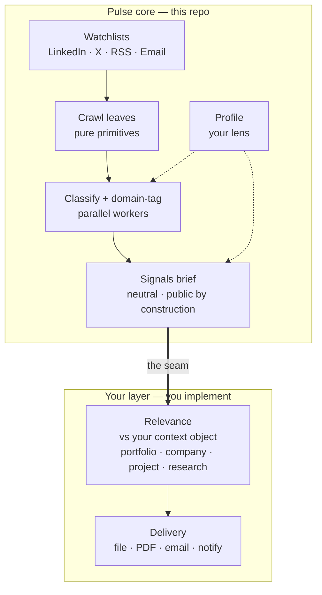

# industry-pulse

> A watchlist-driven intelligence pipeline you run on demand. It crawls LinkedIn, X, RSS, and email, classifies and domain-tags everything in parallel, and writes one neutral **signals brief**. Your own relevance and delivery layer attaches at a documented seam.

The core does the hard, reusable part: turn a curated source list into a dense, cited, domain-organized brief of what happened and why it matters. It deliberately stops there, at a neutral artifact anyone could read. What makes the output *yours* — scoring it against your portfolio, your company, your projects, then routing or delivering it — is a small layer you own, and the repo ships two worked examples of it.

Built as a set of [Claude Code](https://claude.com/claude-code) skills (markdown command files under `.claude/commands/`). You run it by opening the repo in an agent and invoking `/run-pulse`.

## The pipeline



Four crawl leaves pull raw posts per source type. A fan-out of classifier workers buckets each item (authored / reposted / mentioned / drop) and tags it against the domains you define, preserving each source's own framing. The main thread then synthesizes one brief, organized by domain, that reads repetition across sources as salience and framing divergence as insight. Full mechanics in [docs/architecture.md](docs/architecture.md).

## What you get, what you bring

| You get (the core) | You bring |
|---|---|
| Four pure-primitive crawl leaves (LinkedIn, X, RSS, email) | A **profile** — the lens the whole pipeline reads through |
| Parallel classify + domain-tag, with a volume/count auto-scaler | At least one **watchlist** of curated sources |
| One neutral, cited signals brief per run | An **Apify token** for the LinkedIn + X lanes (RSS + email need none paid) |
| Portable markdown schemas for every file | A **Gmail MCP** if you want the email lane |
| Two worked relevance examples at the seam | Your own **relevance + delivery** layer (or one of the examples) |

## How it plugs into your setup

Pulse is path-driven. Every file it reads and writes is a path declared in the `### Global References` block at the top of each skill. That block *is* the configuration surface — there is no hidden loader. Adopt the default layout below, or repoint the paths at your own.

| Path | Role | You provide? |
|---|---|---|
| `config/profile.md` | Your lens: north star, domains, filters. Drives tagging + synthesis. | Yes — copy from `profile.example.md` |
| `config/watchlists/{linkedin,x,rss,email}-watchlist.md` | Curated sources per lane. Empty lanes skip. | Yes — copy from the `.example` files |
| `schemas/` | The portable markdown shapes for every file the pipeline reads or writes. | Ships with the repo |
| `output/raw/`, `output/tagged/` | Per-run intermediates. Gitignored, regenerable. | Generated |
| `output/reports/` | The briefs. Gitignored by default; un-ignore or repoint to keep them. | Generated |
| `.env` | `APIFY_TOKEN` for the paid lanes. | Yes — copy from `.env.example` |
| `.mcp.json` | MCP servers (Apify, Gmail). | Yes — copy from `.mcp.json.example` |

## Quickstart

```bash
git clone <your-fork-url> industry-pulse
cd industry-pulse

cp .env.example .env                 # add your APIFY_TOKEN
cp .mcp.json.example .mcp.json        # configure Apify (+ Gmail if you want email)

cp config/profile.example.md config/profile.md                 # make the lens yours
for f in config/watchlists/*.example.md; do cp "$f" "${f%.example.md}.md"; done   # then curate
```

Then open the repo in Claude Code and run:

```
/run-pulse           # 1-day window across every non-empty lane
/run-pulse --days=7  # a wider weekly compression run
```

The brief lands in `output/reports/pulse-report-<date>/`. Full setup, including the MCP servers, is in [docs/setup.md](docs/setup.md).

> **Configure it with your agent.** You do not have to wire the paths by hand. Open the repo in Claude Code and ask: *"Read `.claude/commands/run-pulse.md` and its Global References, then help me set up my profile, watchlists, and MCP servers."* The skills are written to be read top to bottom, every path and decision explicit, so an agent can onboard you from the files alone.

## The relevance seam

The brief is the boundary. Because it is neutral and personal-free by construction, it is forwardable as-is and is the natural input to a relevance step you implement:

- **IN** — the brief plus a *context object*: a stock portfolio, a company, a project, a research area, anything.
- **PROCESS** — your relevance logic. One sub-agent per context when you check several in parallel; an inline pass when you have one or two.
- **OUT** — a relevance artifact per context, plus whatever you do with it: notify, route, deliver.

`examples/` ships two self-contained implementations — [portfolio-relevance](examples/portfolio-relevance/) (inline, one context) and [project-relevance](examples/project-relevance/) (sub-agent per project). The core never imports them, so delete or replace them freely. The full guide is in [docs/extending.md](docs/extending.md).

## Docs

- [docs/architecture.md](docs/architecture.md) — the three-layer pipeline, the auto-scaler, cost discipline, context isolation.
- [docs/setup.md](docs/setup.md) — MCP servers, `.env`, and a first run from a clean clone.
- [docs/extending.md](docs/extending.md) — the relevance seam, delivery adapters, and adding a new source-type lane.

## License

MIT — see [LICENSE](LICENSE). Derived from an internal system and published as a one-time versioned snapshot, not a synced mirror.
