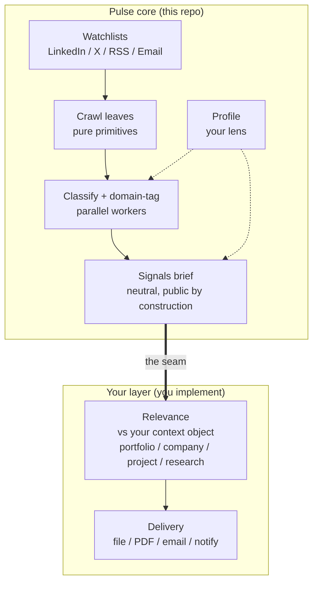
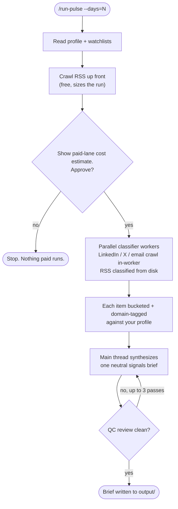

# industry-pulse

[](https://opensource.org/licenses/MIT)
[](https://claude.com/claude-code)

> A watchlist-driven intelligence pipeline you run on demand. It crawls LinkedIn, X, RSS, and email, classifies and domain-tags every post in parallel, and writes one neutral **signals brief**. Your own relevance and delivery layer attaches at a documented seam.

**Status: stable snapshot.** This is a point-in-time release of a system I run privately, complete as shipped and intentionally scoped. It is not actively maintained and is not tracking issues or pull requests. The code does what it was built to do; fork it and make it yours under the MIT license.

Reading your whole field every morning does not scale. The sources multiply, the signal thins out, and most of what you scan you have already seen. Pulse automates the mechanical half of that habit. It pulls from a watchlist you curate, sorts and tags everything against domains you define, and writes one brief that says what moved and why it matters. The brief names no holdings and no projects, so it reads like something you could hand to anyone.

What it does not do is decide what any of that means for you. That judgment is a small layer you own: take the brief, score it against a context you care about, and route the result. Keeping it out of the core is the whole point. The brief stays reusable and forwardable, and the one consequential call, what to actually do about a signal, stays with you. Two worked versions of that layer ship in [`examples/`](examples/).

## 🏗️ How it works

Three layers, each with one job. Crawling, classifying, and writing are kept apart so the heavy reading never lands in the thread doing the synthesis.



Four crawl leaves pull raw posts, one per source type. A fan-out of classifier workers buckets each item (authored, reposted, mentioned, or dropped) and tags it against the domains you defined, keeping each source's own framing intact. The main thread then reads every tagged file and writes the brief, reading repetition across sources as a sign of salience and disagreement between them as a sign of insight. Full mechanics, including the worker auto-scaler, are in [docs/architecture.md](docs/architecture.md).

A single run moves through a free probe, a cost gate you approve, the parallel classify step, and a short quality-control loop before anything is written:



## 📦 What you bring, what you get back

| The core gives you | You bring |
|---|---|
| Four pure-primitive crawl leaves (LinkedIn, X, RSS, email) | A **profile**: the lens the whole pipeline reads through |
| Parallel classify and domain-tag, with a volume-aware auto-scaler | At least one **watchlist** of sources you curate |
| One neutral, cited signals brief per run | An **Apify token** for the LinkedIn and X lanes (RSS and email need nothing paid) |
| Portable markdown schemas for every file | A **Gmail connection** if you want the email lane |
| Two worked relevance examples at the seam | Your own **relevance and delivery** layer, or one of the examples |

## 🧾 What a brief looks like

The output is one markdown file per run. The excerpt below is an illustrative shape rather than a captured run, but the structure and the per-item payload (takeaway, then implication, then why it matters) are exactly what the pipeline produces:

```markdown
# Pulse, 2026-06-22 (24h window)

Coverage: 41 posts across 18 sources · 4 domains · LinkedIn, X, RSS

## Executive summary
Two independent labs signaled custom inference silicon within a day of each
other, and their framing diverged: one led on cost per token, the other on
supply independence. The split is the story, not the announcements.

## AI agent systems
- **Eval tooling is consolidating faster than orchestration.** Three sources
  converged on managed-eval launches this week, which narrows "orchestration
  plus eval" as a single wedge. Worth watching whether orchestration vendors
  answer by acquiring eval rather than building it.
  via @handle · across 3 sources · https://...
```

## ⚡ Quickstart

```bash
git clone <your-fork-url> industry-pulse
cd industry-pulse

cp .env.example .env                 # add your APIFY_TOKEN
cp .mcp.json.example .mcp.json        # configure Apify (+ Gmail if you want email)

cp config/profile.example.md config/profile.md                 # make the lens yours
for f in config/watchlists/*.example.md; do cp "$f" "${f%.example.md}.md"; done   # then curate
```

Then open the repo in Claude Code and run:

```
/run-pulse           # 1-day window across every non-empty lane
/run-pulse --days=7  # a wider weekly compression run
```

The brief lands in `output/reports/pulse-report-<date>/`. Full setup, including the MCP servers, is in [docs/setup.md](docs/setup.md).

> **Let your agent wire it up.** You do not have to set the paths by hand. Open the repo in Claude Code and ask: *"Read `.claude/skills/run-pulse/SKILL.md` and its Global References, then help me set up my profile, watchlists, and MCP servers."* The skills read top to bottom with every path and decision spelled out, so an agent can onboard you from the files alone.

## 🔌 Configuration

Pulse is path-driven. Every file it reads or writes is a path declared in the `### Global References` block at the top of each skill. That block is the configuration surface; there is no hidden loader. Adopt the default layout below or point the paths at your own.

| Path | Role | You provide? |
|---|---|---|
| `config/profile.md` | Your lens: north star, domains, filters. Drives tagging and synthesis. | Yes, copy from `profile.example.md` |
| `config/watchlists/{linkedin,x,rss,email}-watchlist.md` | Curated sources per lane. Empty lanes skip. | Yes, copy from the `.example` files |
| `schemas/` | The portable markdown shapes for every file the pipeline reads or writes. | Ships with the repo |
| `output/raw/`, `output/tagged/` | Per-run intermediates. Gitignored, regenerable. | Generated |
| `output/reports/` | The briefs. Gitignored by default; un-ignore or repoint to keep them. | Generated |
| `.env` | `APIFY_TOKEN` for the paid lanes. | Yes, copy from `.env.example` |
| `.mcp.json` | MCP servers (Apify, Gmail). | Yes, copy from `.mcp.json.example` |

## 🗂️ Repository structure

```
.
├── .claude/skills/   # The pipeline: run-pulse + four crawl leaves (Agent Skills)
├── config/           # Your lens (profile) and per-lane watchlists
├── schemas/          # The markdown contracts every file conforms to
├── docs/             # Architecture, setup, and extension guides
├── examples/         # Two worked relevance implementations at the seam
├── scripts/          # The RSS ingest helper (feedparser)
└── output/           # Generated briefs and intermediates (gitignored)
```

## 🧩 The relevance seam

The brief is the boundary between the reusable core and your layer. Because it is neutral and carries nothing personal, it forwards as-is and feeds cleanly into a relevance step you write.

- **IN** is the brief plus a *context object*: whatever you want it scored against, a stock portfolio, a company's positioning, a side project, a research area.
- **PROCESS** is your relevance logic. Run one sub-agent per context when you check several in parallel, or do it inline when you have one or two.
- **OUT** is a relevance artifact per context, plus whatever you do with it: notify, route, deliver.

[`examples/`](examples/) ships two self-contained versions, [portfolio-relevance](examples/portfolio-relevance/) (inline, one context) and [project-relevance](examples/project-relevance/) (a sub-agent per project). The core never imports them, so delete or replace them freely. The full guide is in [docs/extending.md](docs/extending.md).

## 🧠 Design decisions

A few choices shaped everything downstream. Each one gave something up.

| Decision | Why | What it costs |
|---|---|---|
| **Markdown everywhere, not JSON or a database** | Every file is diffable, readable by a person, and its schema doubles as its documentation. | No machine validation without the schema layer. Fine here, since the consumers are an LLM and a human, not a parser. |
| **Stop at a neutral brief** | The reusable work ends at an artifact that names nothing personal, so it stays forwardable and the core stays decoupled from any one use. | Less "autonomous" out of the box. In exchange, the one consequential decision, what a signal means for you, stays yours. |
| **Parallel crawl and classify, single-thread synthesis** | Reading parallelizes cleanly; judgment does not. Independent workers each see one slice without colliding, but the brief needs one mind holding all of it at once. | Synthesis is a serial step. That is the cost of a brief that reads as one coherent view instead of stitched fragments. |
| **Plain Claude Code skills, no agent framework** | It is a deterministic workflow with model calls at the edges. Orchestrating in code keeps cost and behavior easy to reason about. | Tied to the Claude Code harness rather than portable across runtimes. |

## 💸 Cost and limitations

Only two lanes cost money. RSS and email are free; LinkedIn and X run through paid Apify actors. Two rules hold spend down: every crawl carries a per-source cap (`--linkedin-max-posts`, `--x-max-per-handle`), and the run prints a cost estimate and waits for your approval before any paid call. The free lanes have already run by then, so you only ever approve the paid portion.

Worth knowing before you lean on it:

- **The paid lanes depend on third-party actors.** LinkedIn and X are scraped through Apify actors maintained by others. If one changes or breaks, that lane breaks with it. A fallback actor per lane is the obvious next hardening step.
- **It runs on demand, not on a schedule.** There is no daemon, no cron, no alerting. You invoke it when you want a brief.
- **A lane with no MCP server configured is dropped at the gate, not mid-run.** Pulse checks for Apify and Gmail before spending and tells you what it is skipping.
- **Empty watchlists skip silently.** Run one lane or all four.

## 🛠️ Where you'd take this

Directions worth pursuing if you fork it. None are built; this is where the design points next.

- **Crawl-lane fallback.** Give each paid lane a second actor and fail over when the first breaks, weighted by how fragile each source actually is.
- **Scheduled runs.** Wrap the on-demand invocation in cron or a CI workflow for a daily cadence.
- **A persistent store.** Swap file output for a table or vector store to ask longitudinal questions across briefs.
- **Richer delivery.** The brief is markdown on disk; a thin adapter can render it to PDF or push it to a channel.

## 🚫 Non-goals

- Not a live monitor or alerting system. It is pull-based by design.
- Not multi-tenant and not a hosted service. It is built for one operator running their own instance.
- Not a general agent framework. The skills are specific to this pipeline.

## ❓ FAQ

**Is this maintained?**
No. It is a frozen snapshot of a system I run privately, and issues or pull requests are not being watched. The MIT license means you can fork it and take it wherever you want.

**Why publish an internal tool at all?**
The reusable core, crawl to classify to brief, is useful on its own, and the architecture is worth reading. The layer that made it personal, how I score and deliver briefs, stays private. What is here is the part anyone can build on.

**Why plain Claude Code skills instead of LangChain, CrewAI, or LangGraph?**
Because this is a workflow, not an autonomous agent. The control flow is fixed and the model calls sit at the leaves. Writing it as skills keeps it readable and free of framework churn, and orchestrating in code rather than through an LLM router makes cost and behavior easier to reason about.

**Do I need all four lanes, or a paid account?**
No. RSS and email cost nothing; only LinkedIn and X need an Apify token. Any lane whose watchlist is empty is skipped, so you can start with one.

## 📚 Docs

- [docs/architecture.md](docs/architecture.md): the three layers, the auto-scaler, cost discipline, and context isolation.
- [docs/setup.md](docs/setup.md): MCP servers, `.env`, and a first run from a clean clone.
- [docs/extending.md](docs/extending.md): the relevance seam, delivery adapters, and adding a new source lane.

## 📄 License

MIT, see [LICENSE](LICENSE). Published as a stable, one-time snapshot of a private system rather than a maintained mirror.
